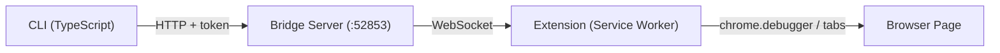

# Browser Bridge CLI

Control an already-open Chrome/Edge browser via CLI through a browser extension.



## Install as Skill

```bash
# Install to Claude Code
npx skills add dreamhunter2333/browser-bridge-cli --agent claude-code

# Install to multiple agents
npx skills add dreamhunter2333/browser-bridge-cli --agent claude-code codex

# Install globally
npx skills add dreamhunter2333/browser-bridge-cli --agent claude-code -g
```

## Prerequisites

- [Bun](https://bun.sh/) >= 1.0 or Node.js >= 20
- Chrome or Edge browser

## Setup

### 1. Install dependencies

```bash
bun install  # or: npm install
```

### 2. Load browser extension

1. Open Chrome/Edge, navigate to `chrome://extensions`
2. Enable **Developer mode** (top right toggle)
3. Click **Load unpacked**
4. Select the `extension/` directory from this project

### 3. Start bridge server

```bash
bun bridge/src/server.ts          # or: npx tsx bridge/src/server.ts
```

### 4. Pair extension

```bash
bun cli/src/index.ts pair         # or: npx tsx cli/src/index.ts pair
```

Copy the 6-digit code, click the Browser Bridge extension icon in the toolbar, enter the code and click **Pair**.

## CLI Commands

All commands support both runtimes:

```bash
bun cli/src/index.ts <command>    # Bun
npx tsx cli/src/index.ts <command> # Node.js
```

```bash
# Server
info                          # Server status + connected clients
pair                          # Generate pairing code
clients                       # List connected clients
switch <clientId>             # Switch active client

# Tabs
tabs                          # List all tabs
tab <id>                      # Get tab details
new-tab [url]                 # Create tab
close-tab <id>                # Close tab
activate <id>                 # Switch to tab
navigate <url> [-t id]        # Navigate tab
reload [-t id] [--no-cache]   # Reload tab

# JS & DOM
eval <expr> [-t id] [-k]      # Execute JS expression
eval-file <file> [-t id]      # Execute JS file
query <selector> [-t id]      # Query DOM elements

# Capture
screenshot [-o file] [-f] [-t id]   # Screenshot
pdf [-o file] [-t id]               # Export as PDF

# Network & Cookies
network [-l limit] [--clear]  # View/clear network log
cookies [-u url] [-d domain]  # Get cookies

# Raw CDP
cdp <method> [params] [-t id] [-k]  # Any Chrome DevTools Protocol method
detach [-t id]                      # Detach debugger
```


## Security

- Bridge binds to `127.0.0.1` by default
- CLI authenticates via server token (`~/.browser-bridge/token`)
- Each extension has independent client token (generated on pairing)
- Pairing codes are one-time-use, expire in 5 minutes
- Whitelist restricts per-tab operations by URL pattern

## License

MIT
