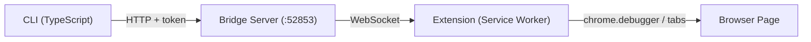

# Browser Bridge CLI

Control an already-open Chrome/Edge browser via CLI through a browser extension.



## Install

```bash
# Global install
npm i -g browser-bridge-cli

# Or use directly (no install)
npx browser-bridge-cli info
```

### Install as AI Agent Skill

```bash
npx skills add dreamhunter2333/browser-bridge-cli:skill --agent claude-code
npx skills add dreamhunter2333/browser-bridge-cli:skill --agent claude-code codex
```

## Prerequisites

- Node.js >= 20 or [Bun](https://bun.sh/) >= 1.0
- Chrome or Edge browser

## Setup

### 1. Load browser extension

1. Open Chrome/Edge → `chrome://extensions`
2. Enable **Developer mode**
3. Click **Load unpacked** → select `extension/` directory

### 2. Start server + pair

```bash
browser-bridge server start
browser-bridge pair
# Enter 6-digit code in extension popup
```

## CLI Commands

```bash
# Server management
browser-bridge server start [--host 0.0.0.0] [--port 9000] [--token xxx]
browser-bridge server stop
browser-bridge server status
browser-bridge server gen-pair
browser-bridge server install-service [--uninstall]   # systemd daemon (Linux)

# Pairing
browser-bridge pair [-n name]               # Local: generate code for extension
browser-bridge pair --server http://remote   # Remote: enter code to pair CLI
browser-bridge unpair                        # Revoke + clear credentials

# Configuration
browser-bridge config get                    # Show config (tokens masked)
browser-bridge config set <key> <value>      # Set server, token, or name
browser-bridge config reset                  # Clear all config

# Browser control
browser-bridge info                          # Server status + clients
browser-bridge tabs                          # List all tabs
browser-bridge tab <id>                      # Tab details
browser-bridge eval <expr> [-t id] [-k]      # Execute JS
browser-bridge eval-file <file> [-t id]      # Execute JS file
browser-bridge query <selector> [-t id]      # Query DOM
browser-bridge new-tab [url]                 # Create tab
browser-bridge close-tab <id>                # Close tab
browser-bridge activate <id>                 # Switch tab
browser-bridge navigate <url> [-t id]        # Navigate
browser-bridge reload [-t id] [--no-cache]   # Reload
browser-bridge screenshot [-o file] [-f]     # Screenshot
browser-bridge pdf [-o file] [-t id]         # PDF export
browser-bridge network [-l limit] [--clear]  # Network log
browser-bridge cookies [-u url] [-d domain]  # Cookies
browser-bridge cdp <method> [params] [-t id] # Raw CDP command
browser-bridge detach [-t id]                # Detach debugger
browser-bridge clients                       # List clients
browser-bridge switch <clientId>             # Switch active client
```

Global options: `-s, --server <url>`, `--token <token>`

Config priority: CLI flags > env vars (`BROWSER_BRIDGE_URL`, `BROWSER_BRIDGE_TOKEN`) > `~/.browser-bridge/config.json` > `~/.browser-bridge/state.json`

## Development

```bash
bun install
bun run dev -- info          # Run CLI in dev mode
bun run dev:server           # Run server in dev mode
bun run build                # Build for npm
bun run test                 # Run Playwright e2e tests
```

## Security

- Bridge binds to `127.0.0.1` by default
- Server token controls admin operations (pair code generation, token revocation)
- Client tokens can execute browser commands but cannot generate pair codes
- Rate limiting on pairing (HTTP: 5/min per IP, WS: 5 failures per connection)
- Pairing codes are one-time-use, expire in 5 minutes
- Token revoke disconnects WS clients
- Whitelist restricts per-tab operations by URL pattern

## License

MIT
