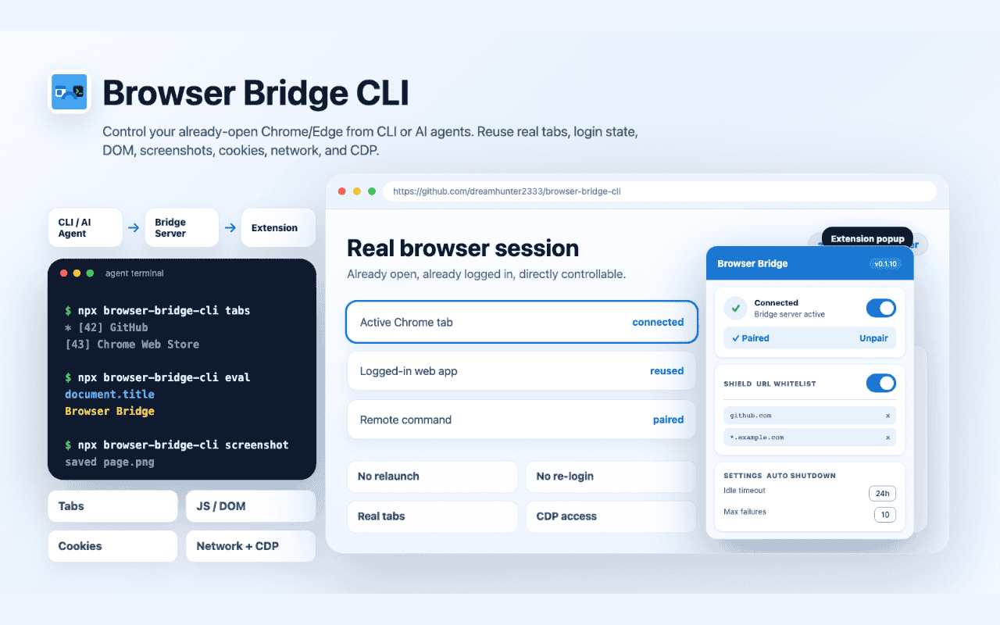
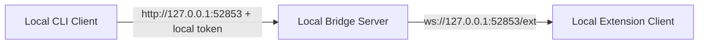
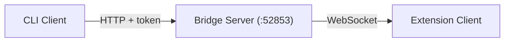
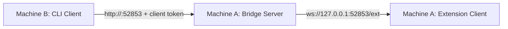
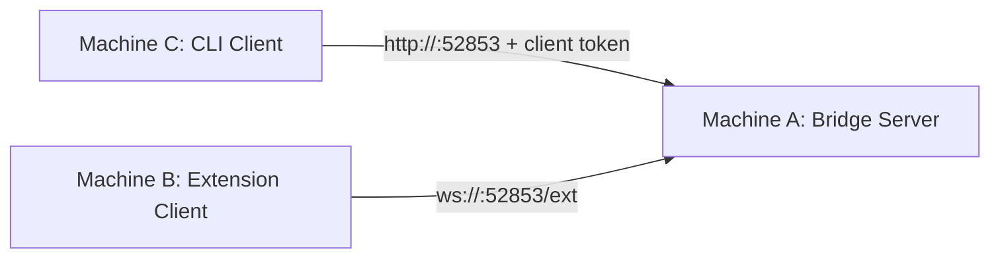

# Browser Bridge CLI

[English](./README.md) | [中文](./README_CN.md)

Control an already-open Chrome/Edge browser from a CLI through a paired browser extension.



## AI Agent Skills

### Browser Bridge CLI

```bash
# Install to Claude Code
npx skills add dreamhunter2333/browser-bridge-cli/skills/browser-bridge-cli --agent claude-code

# Install to multiple agents
npx skills add dreamhunter2333/browser-bridge-cli/skills/browser-bridge-cli --agent claude-code codex

# Install globally
npx skills add dreamhunter2333/browser-bridge-cli/skills/browser-bridge-cli --agent claude-code -g
```

### Browser Bridge CLI Skill Generator

Use this skill to create workflow skills for operating one or more websites with Browser Bridge CLI.

```bash
# Install to Claude Code
npx skills add dreamhunter2333/browser-bridge-cli/skills/browser-bridge-cli-skill-generator --agent claude-code

# Install to multiple agents
npx skills add dreamhunter2333/browser-bridge-cli/skills/browser-bridge-cli-skill-generator --agent claude-code codex

# Install globally
npx skills add dreamhunter2333/browser-bridge-cli/skills/browser-bridge-cli-skill-generator --agent claude-code -g
```

## Quick Start

This is the default setup: CLI, Bridge Server, browser, and extension all run on the same machine.

<details>
<summary>Local topology</summary>



</details>

### 1. Install

```bash
# Global install
npm i -g browser-bridge-cli

# Or use directly
npx browser-bridge-cli info

# Or with Bun
bunx browser-bridge-cli info
```

### 2. Install browser extension

Install Browser Bridge from the [Chrome Web Store](https://chromewebstore.google.com/detail/browser-bridge/cmakbjpcmibhleibmgaiflpoencnelol).

<details>
<summary>Manual installation</summary>

For manual installation, download the extension asset from [GitHub Releases](https://github.com/dreamhunter2333/browser-bridge-cli/releases):

- `.zip`: unzip it and load the folder with **Load unpacked**.
- Source: load the `extension/` directory from the source code.

1. Open Chrome/Edge -> `chrome://extensions`
2. Enable **Developer mode**
3. Click **Load unpacked** -> select the extension directory

</details>

### 3. Start server and pair extension

```bash
npx browser-bridge-cli server start
npx browser-bridge-cli server gen-pair
```

Open the extension popup, enable the toggle, keep `ws://127.0.0.1:52853/ext`, enter the 6-digit code, and click **Pair**.

### 4. Verify

```bash
npx browser-bridge-cli info
npx browser-bridge-cli tabs
```

Local CLI commands do not need `--server`. The CLI reads local server state from `~/.browser-bridge/`, and the server binds to `127.0.0.1` by default.

<details>
<summary>Architecture</summary>



</details>

## Compared with Playwright CLI and OpenCLI

Playwright CLI is a strong browser automation and testing tool. Its [attach flow](https://playwright.dev/agent-cli/commands/attach) and [MCP extension mode](https://playwright.dev/mcp/configuration/browser-extension) can now connect to existing Chrome/Edge sessions through CDP, Playwright server endpoints, or the Playwright Extension, so it can reuse logged-in sessions and existing browser tabs.

OpenCLI turns websites, browser sessions, Electron apps, and local tools into CLI surfaces for humans and AI agents. It is strongest when you want deterministic site commands, reusable adapters, and a broader command hub.

Browser Bridge CLI is not trying to replace Playwright tests or OpenCLI adapters. It is a small control bridge for an already-open daily browser, especially when commands need to come from another terminal, another agent, or another machine.

| Area | Browser Bridge CLI | Playwright CLI | OpenCLI |
| --- | --- | --- | --- |
| Product focus | Remote-control bridge for a user's real Chrome/Edge session | Automation, testing, and agent workflows built on Playwright | CLI hub for websites, browser sessions, Electron apps, and local tools |
| Browser connection | Paired extension -> Bridge Server -> CLI | Launched browser, CDP attach, Playwright endpoint, or Playwright Extension | Browser extension plus local daemon, with profile/session selection |
| Existing logged-in browser | Default use case | Supported by CDP attach or extension mode | Supported through Chrome session reuse |
| Tab model | Lists, switches, and controls open tabs by tab id, subject to whitelist rules | Usually operates on a Playwright session/page; extension mode attaches to selected/authorized tabs instead of acting as a global tab-control bridge | Works through browser sessions, targets, and adapters; less focused on global tab brokering |
| Remote topology | Built in: CLI, server, and extension can run on one, two, or three machines | Usually local; remote use is via CDP endpoint, Playwright server, tunnel, or MCP setup | Primarily local browser/daemon workflow |
| Command surface | Direct CLI primitives: tabs, eval, query, screenshot, PDF, cookies, network, raw CDP | Rich automation model: locators, assertions, snapshots, tracing, storage state, test runner | Site adapters, browser primitives, Electron app adapters, and registered local CLI tools |
| Auth model | Pair codes plus server/client tokens; remote CLIs can be paired and revoked | Depends on Playwright session, CDP endpoint, MCP client, or extension permission flow | Reuses Chrome login state through the extension/daemon setup |

Use Playwright CLI when you want repeatable browser automation, tests, locators, assertions, tracing, or Playwright's agent tooling. Use OpenCLI when you want deterministic commands and adapters for specific sites, desktop apps, or local tools. Use Browser Bridge CLI when you want a lightweight command bridge into a real browser that is already open, with explicit tab control and remote-machine deployment as first-class workflows.

## Advanced Deployment

Use these topologies when the CLI is not on the same machine as the extension and/or Bridge Server.

### Two Machines

<details>
<summary><strong>Two Machines: Server + Extension together, CLI remote</strong></summary>

Use this topology when the browser and extension run on one machine, and commands are sent from another machine.



On Machine A, start the server on an address reachable from Machine B:

```bash
npx browser-bridge-cli server start --host 0.0.0.0 --port 52853 --token <server-token>
npx browser-bridge-cli server gen-pair
```

In the extension popup on Machine A:

1. Enable the extension toggle.
2. Keep the server URL as `ws://127.0.0.1:52853/ext`.
3. Enter the 6-digit pairing code and click **Pair**.

Generate a fresh pairing code on Machine A for the remote CLI:

```bash
npx browser-bridge-cli server gen-pair
```

On Machine B, pair with Machine A:

```bash
npx browser-bridge-cli pair --server http://<browser-machine-ip>:52853 -n <cli-name>
```

Then run commands from Machine B:

```bash
npx browser-bridge-cli info
npx browser-bridge-cli tabs
npx browser-bridge-cli new-tab https://example.com
```

Notes:

- Machine A must allow inbound TCP `52853` from Machine B.
- Pairing codes are one-time-use and expire in 5 minutes.
- Do not run `server ...` commands from Machine B.

</details>

### Three Machines

<details>
<summary><strong>Three Machines: Server, Extension, and CLI separated</strong></summary>

Use this topology when the Bridge Server is hosted separately from both the browser machine and the CLI machine.



On Machine A, start the server:

```bash
npx browser-bridge-cli server start --host 0.0.0.0 --port 52853 --token <server-token>
npx browser-bridge-cli server gen-pair
```

On Machine B, load the extension and pair it:

1. Enable the extension toggle.
2. Set the server URL to `ws://<server-ip>:52853/ext`.
3. Enter the 6-digit pairing code generated on Machine A.
4. Click **Pair**.

Generate a fresh pairing code on Machine A for the CLI:

```bash
npx browser-bridge-cli server gen-pair
```

On Machine C, pair with Machine A:

```bash
npx browser-bridge-cli pair --server http://<server-ip>:52853 -n <cli-name>
```

Then run commands from Machine C:

```bash
npx browser-bridge-cli info
npx browser-bridge-cli tabs
npx browser-bridge-cli new-tab https://example.com
```

Notes:

- Machine A must allow inbound TCP `52853` from Machines B and C.
- Use a private network, VPN, SSH tunnel, or HTTPS reverse proxy when possible.
- Keep `<server-token>` on Machine A only.

</details>

## Command Rules

- Run `server ...` commands only on the Bridge Server machine.
- Do not pass `--server` to `server ...` commands.
- On a remote CLI machine, `pair` must include `--server http://<server-host>:52853`.
- After remote CLI pairing, saved config lets normal browser-control commands omit `--server`.
- For one-off remote commands, pass `--server http://<server-host>:52853 --token <client-token>`.

## Token Model

- Server token: admin credential stored on the Bridge Server machine. It can generate pairing codes and revoke client tokens.
- Extension client token: stored by the browser extension after pairing. It authenticates the extension WebSocket.
- CLI client token: stored by `pair --server` on a remote CLI machine. It can execute browser commands but cannot generate pairing codes or manage the server.

Pairing codes are one-time-use and expire in 5 minutes. Generate one code per client.

## CLI Commands

`bunx browser-bridge-cli ...` can be used anywhere `npx browser-bridge-cli ...` appears below.

```bash
# Server management
npx browser-bridge-cli server start [--host 0.0.0.0] [--port 9000] [--token xxx]
npx browser-bridge-cli server stop
npx browser-bridge-cli server status
npx browser-bridge-cli server gen-pair
npx browser-bridge-cli server install-service [--uninstall]   # systemd daemon (Linux)

# Pairing
npx browser-bridge-cli pair [-n name]                 # Local shortcut: generate an extension pairing code
npx browser-bridge-cli pair --server http://remote    # Remote CLI: enter code generated on the server
npx browser-bridge-cli unpair                         # Revoke + clear credentials

# Configuration
npx browser-bridge-cli config get                    # Show config (tokens masked)
npx browser-bridge-cli config set <key> <value>      # Set server, token, or name
npx browser-bridge-cli config reset                  # Clear all config

# Browser control
npx browser-bridge-cli info                          # Server status + clients
npx browser-bridge-cli tabs                          # List all tabs
npx browser-bridge-cli tab <id>                      # Tab details
npx browser-bridge-cli eval <expr> [-t id] [-k]      # Execute JS
npx browser-bridge-cli eval-file <file> [-t id]      # Execute JS file
npx browser-bridge-cli query <selector> [-t id]      # Query DOM
npx browser-bridge-cli new-tab [url]                 # Create tab
npx browser-bridge-cli close-tab <id>                # Close tab
npx browser-bridge-cli activate <id>                 # Switch tab
npx browser-bridge-cli navigate <url> [-t id]        # Navigate
npx browser-bridge-cli reload [-t id] [--no-cache]   # Reload
npx browser-bridge-cli screenshot [-o file] [-f] [--long --max-height px --hide-sticky] [--x px --y px --width px --height px] # Screenshot
npx browser-bridge-cli pdf [-o file] [-t id]         # PDF export
npx browser-bridge-cli network [-l limit] [-t id] [--clear] # CDP network log for a tab
npx browser-bridge-cli cookies [-u url] [-d domain] [-t id]  # CDP cookies for a tab URL context
npx browser-bridge-cli cdp <method> [params] [-t id] # Raw CDP command
npx browser-bridge-cli detach [-t id]                # Detach debugger
npx browser-bridge-cli clients                       # List clients
npx browser-bridge-cli switch <clientId>             # Switch active client
```

Long screenshots use the current viewport width and adapt height from the page. The default maximum height is `30000`; use `--max-height` to cap pages with very large or infinite scroll content. Fixed elements are hidden after the first slice to avoid repeated headers; sticky elements are preserved by default and can be hidden with `--hide-sticky`.

Network and cookie commands use CDP on the target tab. `network` enables and reads a per-tab CDP Network cache; it does not use extension-wide `webRequest` access.

```bash
npx browser-bridge-cli screenshot --long -o page.png
npx browser-bridge-cli screenshot --long --max-height 12000 -o page.png
npx browser-bridge-cli screenshot --long --hide-sticky -o page.png
```

Global options: `-s, --server <url>`, `--token <token>`

Config priority: CLI flags > env vars (`BROWSER_BRIDGE_URL`, `BROWSER_BRIDGE_TOKEN`) > `~/.browser-bridge/config.json` > `~/.browser-bridge/state.json`

## Supported Platforms

- Windows, macOS, and Linux are supported for normal CLI usage.
- `server install-service` is Linux-only because it installs a systemd user service.
- CI runs build and e2e tests on both `ubuntu-latest` and `windows-latest`.

## Development

```bash
bun install
bun run dev -- info          # Run CLI in dev mode
bun run dev:server           # Run server in dev mode
bun run build                # Build for npm
bun run test                 # Run Playwright e2e tests
```

## Security

- Bridge binds to `127.0.0.1` by default.
- Server token controls admin operations.
- Client tokens can execute browser commands but cannot generate pair codes.
- Rate limiting on pairing: HTTP 5/min per IP, WS 5 failures per connection.
- Pairing codes are one-time-use and expire in 5 minutes.
- Token revoke disconnects WebSocket clients.
- Whitelist restricts per-tab operations by URL pattern.

Privacy policy: [PRIVACY.md](./PRIVACY.md)

## License

MIT
