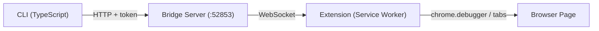

# Browser Bridge CLI

Control an already-open Chrome/Edge browser via CLI through a browser extension.



## Install as Skill

```bash
# Install to Claude Code
npx skills add dreamhunter2333/browser-bridge-cli --agent claude-code

# Install to multiple agents
npx skills add dreamhunter2333/browser-bridge-cli --agent claude-code codex

# Install globally
npx skills add dreamhunter2333/browser-bridge-cli --agent claude-code -g
```

## Prerequisites

- [Bun](https://bun.sh/) >= 1.0 or Node.js >= 20
- Chrome or Edge browser

## Setup

### 1. Install dependencies

```bash
bun install  # or: npm install
```

### 2. Load browser extension

1. Open Chrome/Edge, navigate to `chrome://extensions`
2. Enable **Developer mode** (top right toggle)
3. Click **Load unpacked**
4. Select the `extension/` directory from this project

### 3. Start bridge server

```bash
# Auto-start (CLI starts server automatically when needed)
bun cli/src/index.ts info

# Or start explicitly
bun cli/src/index.ts start

# Remote / container (public access)
bun cli/src/index.ts start --host 0.0.0.0
bun cli/src/index.ts start --host 0.0.0.0 --port 9000 --token my-fixed-token

# Manage server
bun cli/src/index.ts status    # Check if running
bun cli/src/index.ts stop      # Stop server
```

### 4. Pair extension

```bash
bun cli/src/index.ts pair
```

Copy the 6-digit code, click the Browser Bridge extension icon in the toolbar, enter the code and click **Pair**.

## Remote Server

The bridge server can be deployed on a remote machine or container, and the CLI can connect to it from anywhere.

### Deploy server

```bash
# On remote machine / container
bun bridge/src/server.ts --host 0.0.0.0 --token my-server-token

# Generate a pairing code for CLI
bun bridge/src/server.ts --gen-pair
```

### Pair CLI with remote server

```bash
# Enter the pairing code generated on the server
bun cli/src/index.ts pair --server http://remote-host:52853
```

The token is saved to `~/.browser-bridge/config.json`. Subsequent commands automatically use the stored config:

```bash
bun cli/src/index.ts tabs
bun cli/src/index.ts eval "document.title"
```

### CLI configuration

```bash
# Set remote server
bun cli/src/index.ts config set server http://remote:52853

# View config (tokens are masked)
bun cli/src/index.ts config get

# Clear config (revert to local)
bun cli/src/index.ts config reset

# Remove remote credentials + revoke server token
bun cli/src/index.ts unpair
```

Config priority: CLI flags (`--server`, `--token`) > env vars (`BROWSER_BRIDGE_URL`, `BROWSER_BRIDGE_TOKEN`) > `~/.browser-bridge/config.json` > `~/.browser-bridge/state.json`

## CLI Commands

All commands support both runtimes:

```bash
bun cli/src/index.ts <command>    # Bun
npx tsx cli/src/index.ts <command> # Node.js
```

Global options: `-s, --server <url>` and `--token <token>` to override server connection.

```bash
# Server
info                          # Server status + connected clients
start [--host] [--port] [--token]  # Start server in background
stop                          # Stop server
status                        # Check server running state
pair [-n name]                # Pair with bridge server
unpair                        # Remove remote credentials
clients                       # List connected clients
switch <clientId>             # Switch active client
install-service [--host] [--port] [--token] [--uninstall]  # Install/remove systemd service (Linux)

# Config
config get                    # Show current config
config set <key> <value>      # Set config (server, token, name)
config reset                  # Clear all config

# Tabs
tabs                          # List all tabs
tab <id>                      # Get tab details
new-tab [url]                 # Create tab
close-tab <id>                # Close tab
activate <id>                 # Switch to tab
navigate <url> [-t id]        # Navigate tab
reload [-t id] [--no-cache]   # Reload tab

# JS & DOM
eval <expr> [-t id] [-k]      # Execute JS expression
eval-file <file> [-t id]      # Execute JS file
query <selector> [-t id]      # Query DOM elements

# Capture
screenshot [-o file] [-f] [-t id]   # Screenshot
pdf [-o file] [-t id]               # Export as PDF

# Network & Cookies
network [-l limit] [--clear]  # View/clear network log
cookies [-u url] [-d domain]  # Get cookies

# Raw CDP
cdp <method> [params] [-t id] [-k]  # Any Chrome DevTools Protocol method
detach [-t id]                      # Detach debugger
```

## Daemon (Linux systemd)

Auto-install as a systemd user service for persistent background running:

```bash
# Install and start service
bun cli/src/index.ts install-service --host 0.0.0.0 --token my-token

# Check status / logs
systemctl --user status browser-bridge
journalctl --user -u browser-bridge -f

# Uninstall
bun cli/src/index.ts install-service --uninstall
```

## Testing

```bash
npx playwright test
```

32 e2e tests covering server API, HTTP/WS pairing, rate limiting, token revoke, privilege controls, extension interaction, CLI commands, and end-to-end flows.

## Security

- Bridge binds to `127.0.0.1` by default (use `--host 0.0.0.0` for public access)
- Server token (`--token` or auto-generated) controls admin operations (pair code generation, token revocation)
- Client tokens (issued via pairing) can execute browser commands but cannot generate new pair codes
- `/api/pair` rate-limited (5 attempts/min per IP), WS pair rate-limited (5 failures per connection)
- `/api/health` returns minimal info without auth, full client list requires auth
- `/api/clients` requires auth
- Pairing codes are one-time-use, expire in 5 minutes
- Name collision check prevents token hijacking (HTTP and WS)
- Token revoke disconnects WS clients and switches active client
- Clients can self-revoke their own tokens; cross-client revoke requires server token
- Whitelist restricts per-tab operations by URL pattern

## License

MIT
