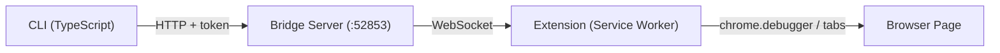

# Browser Bridge CLI

[English](./README.md) | [中文](./README_CN.md)

Control an already-open Chrome/Edge browser via CLI through a browser extension.



## Install

```bash
# Global install
npm i -g browser-bridge-cli

# Or use directly (no install)
npx browser-bridge-cli info

# Or with Bun
bunx browser-bridge-cli info
```

### Install as AI Agent Skill

```bash
# Install to Claude Code
npx skills add dreamhunter2333/browser-bridge-cli/skill --agent claude-code

# Install to multiple agents
npx skills add dreamhunter2333/browser-bridge-cli/skill --agent claude-code codex

# Install globally
npx skills add dreamhunter2333/browser-bridge-cli/skill --agent claude-code -g
```

## Prerequisites

- Node.js >= 20 or [Bun](https://bun.sh/) >= 1.0
- Chrome or Edge browser

## Supported Platforms

- Windows, macOS, and Linux are supported for normal CLI usage, including `server start`, `server stop`, `server status`, pairing, tab control, screenshots, PDF export, network logs, cookies, and raw CDP commands.
- `server install-service` is Linux-only because it installs a systemd user service. On Windows and macOS, start the bridge with `server start` instead.
- CI runs build and e2e tests on both `ubuntu-latest` and `windows-latest`.

## Setup

### 1. Load browser extension

Download the extension zip from [GitHub Releases](https://github.com/dreamhunter2333/browser-bridge-cli/releases), or use the `extension/` directory from the source code.

1. Open Chrome/Edge → `chrome://extensions`
2. Enable **Developer mode**
3. Click **Load unpacked** → select the unzipped extension directory

### 2. Start server + pair

```bash
# 1. Start server
npx browser-bridge-cli server start

# 2. Open extension popup → enable toggle → (optional: set server URL)

# 3. Generate pairing code
npx browser-bridge-cli server gen-pair

# 4. Enter the 6-digit code in extension popup → click Pair
```

## CLI Commands

`bunx browser-bridge-cli ...` can be used anywhere `npx browser-bridge-cli ...` appears below.

```bash
# Server management
npx browser-bridge-cli server start [--host 0.0.0.0] [--port 9000] [--token xxx]
npx browser-bridge-cli server stop
npx browser-bridge-cli server status
npx browser-bridge-cli server gen-pair
npx browser-bridge-cli server install-service [--uninstall]   # systemd daemon (Linux)

# Pairing
npx browser-bridge-cli pair [-n name]               # Local: generate code for extension
npx browser-bridge-cli pair --server http://remote   # Remote: enter code to pair CLI
npx browser-bridge-cli unpair                        # Revoke + clear credentials

# Configuration
npx browser-bridge-cli config get                    # Show config (tokens masked)
npx browser-bridge-cli config set <key> <value>      # Set server, token, or name
npx browser-bridge-cli config reset                  # Clear all config

# Browser control
npx browser-bridge-cli info                          # Server status + clients
npx browser-bridge-cli tabs                          # List all tabs
npx browser-bridge-cli tab <id>                      # Tab details
npx browser-bridge-cli eval <expr> [-t id] [-k]      # Execute JS
npx browser-bridge-cli eval-file <file> [-t id]      # Execute JS file
npx browser-bridge-cli query <selector> [-t id]      # Query DOM
npx browser-bridge-cli new-tab [url]                 # Create tab
npx browser-bridge-cli close-tab <id>                # Close tab
npx browser-bridge-cli activate <id>                 # Switch tab
npx browser-bridge-cli navigate <url> [-t id]        # Navigate
npx browser-bridge-cli reload [-t id] [--no-cache]   # Reload
npx browser-bridge-cli screenshot [-o file] [-f]     # Screenshot
npx browser-bridge-cli pdf [-o file] [-t id]         # PDF export
npx browser-bridge-cli network [-l limit] [--clear]  # Network log
npx browser-bridge-cli cookies [-u url] [-d domain]  # Cookies
npx browser-bridge-cli cdp <method> [params] [-t id] # Raw CDP command
npx browser-bridge-cli detach [-t id]                # Detach debugger
npx browser-bridge-cli clients                       # List clients
npx browser-bridge-cli switch <clientId>             # Switch active client
```

Global options: `-s, --server <url>`, `--token <token>`

Config priority: CLI flags > env vars (`BROWSER_BRIDGE_URL`, `BROWSER_BRIDGE_TOKEN`) > `~/.browser-bridge/config.json` > `~/.browser-bridge/state.json`

## Development

```bash
bun install
bun run dev -- info          # Run CLI in dev mode
bun run dev:server           # Run server in dev mode
bun run build                # Build for npm
bun run test                 # Run Playwright e2e tests
```

## Security

- Bridge binds to `127.0.0.1` by default
- Server token controls admin operations (pair code generation, token revocation)
- Client tokens can execute browser commands but cannot generate pair codes
- Rate limiting on pairing (HTTP: 5/min per IP, WS: 5 failures per connection)
- Pairing codes are one-time-use, expire in 5 minutes
- Token revoke disconnects WS clients
- Whitelist restricts per-tab operations by URL pattern

## License

MIT
