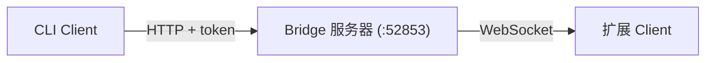
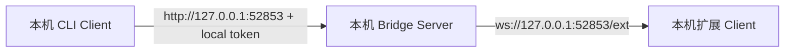
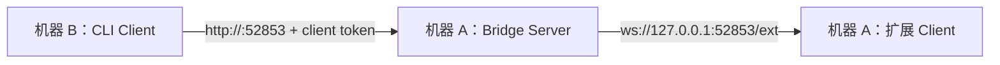
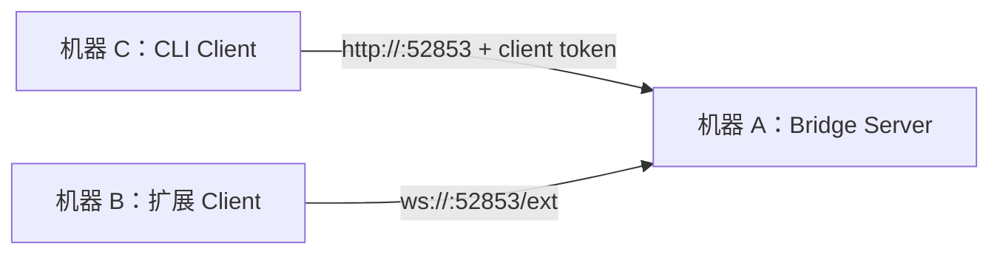

# Browser Bridge CLI

[English](./README.md) | [中文](./README_CN.md)

通过浏览器扩展，使用命令行控制已打开的 Chrome/Edge 浏览器。



## AI Agent Skill

```bash
# 安装到 Claude Code
npx skills add dreamhunter2333/browser-bridge-cli/skill --agent claude-code

# 安装到多个 agent
npx skills add dreamhunter2333/browser-bridge-cli/skill --agent claude-code codex

# 全局安装
npx skills add dreamhunter2333/browser-bridge-cli/skill --agent claude-code -g
```

## 单机快速开始

这是默认部署：CLI、Bridge Server、浏览器和扩展都在同一台机器上运行。



### 1. 安装

```bash
# 全局安装
npm i -g browser-bridge-cli

# 或直接使用
npx browser-bridge-cli info

# 或使用 Bun
bunx browser-bridge-cli info
```

### 2. 加载浏览器扩展

从 [GitHub Releases](https://github.com/dreamhunter2333/browser-bridge-cli/releases) 下载扩展 zip 包，或使用源码中的 `extension/` 目录。

1. 打开 Chrome/Edge -> `chrome://extensions`
2. 开启 **开发者模式**
3. 点击 **加载已解压的扩展** -> 选择解压后的扩展目录

### 3. 启动 Server 并配对扩展

```bash
npx browser-bridge-cli server start
npx browser-bridge-cli server gen-pair
```

打开扩展弹窗，打开开关，保持 `ws://127.0.0.1:52853/ext`，输入 6 位配对码，然后点击 **Pair**。

### 4. 验证

```bash
npx browser-bridge-cli info
npx browser-bridge-cli tabs
```

本机 CLI 命令不需要 `--server`。CLI 会从 `~/.browser-bridge/` 读取本机 server state，Server 默认绑定 `127.0.0.1`。

## 高级部署

当 CLI 不在扩展和/或 Bridge Server 所在机器上时，使用下面的高级部署方式。

<details>
<summary><strong>两台机器：Server + Extension 同机，CLI 远程</strong></summary>

适用于浏览器和扩展在一台机器上运行，命令从另一台机器发出的场景。



在机器 A 上，把 Server 启动在机器 B 可以访问到的地址上：

```bash
npx browser-bridge-cli server start --host 0.0.0.0 --port 52853 --token <server-token>
npx browser-bridge-cli server gen-pair
```

在机器 A 的扩展弹窗里：

1. 打开扩展开关。
2. 服务器 URL 保持为 `ws://127.0.0.1:52853/ext`。
3. 输入 6 位配对码并点击 **Pair**。

在机器 A 上为远程 CLI 生成新的配对码：

```bash
npx browser-bridge-cli server gen-pair
```

在机器 B 上配对机器 A：

```bash
npx browser-bridge-cli pair --server http://<browser-machine-ip>:52853 -n <cli-name>
```

然后从机器 B 执行命令：

```bash
npx browser-bridge-cli info
npx browser-bridge-cli tabs
npx browser-bridge-cli new-tab https://example.com
```

注意：

- 机器 A 需要允许机器 B 访问 TCP `52853`。
- 配对码只能使用一次，5 分钟过期。
- 不要在机器 B 上执行 `server ...` 命令。

</details>

<details>
<summary><strong>三台机器：Server、Extension、CLI 分离</strong></summary>

适用于 Bridge Server、浏览器扩展、CLI 分别运行在不同机器上的场景。



在机器 A 上启动 Server：

```bash
npx browser-bridge-cli server start --host 0.0.0.0 --port 52853 --token <server-token>
npx browser-bridge-cli server gen-pair
```

在机器 B 上加载扩展并配对：

1. 打开扩展开关。
2. 把服务器 URL 设置为 `ws://<server-ip>:52853/ext`。
3. 输入机器 A 生成的 6 位配对码。
4. 点击 **Pair**。

在机器 A 上为 CLI 生成新的配对码：

```bash
npx browser-bridge-cli server gen-pair
```

在机器 C 上配对机器 A：

```bash
npx browser-bridge-cli pair --server http://<server-ip>:52853 -n <cli-name>
```

然后从机器 C 执行命令：

```bash
npx browser-bridge-cli info
npx browser-bridge-cli tabs
npx browser-bridge-cli new-tab https://example.com
```

注意：

- 机器 A 需要允许机器 B 和机器 C 访问 TCP `52853`。
- 尽量使用内网、VPN、SSH tunnel 或 HTTPS 反向代理。
- `<server-token>` 只保留在机器 A。

</details>

## 命令规则

- `server ...` 命令只在 Bridge Server 所在机器执行。
- 不要给 `server ...` 命令传 `--server`。
- 远程 CLI 机器执行 `pair` 时必须带 `--server http://<server-host>:52853`。
- 远程 CLI 配对后，普通浏览器控制命令可以通过保存的配置省略 `--server`。
- 单条远程命令可以传 `--server http://<server-host>:52853 --token <client-token>`。

## Token 模型

- Server token：Bridge Server 机器上的管理凭证，可以生成配对码和撤销 client token。
- 扩展 client token：扩展配对后保存，用于认证扩展 WebSocket。
- CLI client token：远程 CLI 机器执行 `pair --server` 后保存，可以执行浏览器命令，但不能生成配对码或管理 server。

配对码只能使用一次，5 分钟过期。每个 client 都需要单独生成一个配对码。

## 命令列表

下方所有 `npx browser-bridge-cli ...` 命令都可以等价替换为 `bunx browser-bridge-cli ...`。

```bash
# 服务器管理
npx browser-bridge-cli server start [--host 0.0.0.0] [--port 9000] [--token xxx]
npx browser-bridge-cli server stop
npx browser-bridge-cli server status
npx browser-bridge-cli server gen-pair
npx browser-bridge-cli server install-service [--uninstall]   # systemd 守护进程 (Linux)

# 配对
npx browser-bridge-cli pair [-n name]                  # 本机快捷方式：生成扩展配对码
npx browser-bridge-cli pair --server http://remote     # 远程 CLI：输入 Server 生成的配对码
npx browser-bridge-cli unpair                          # 撤销凭证

# 配置
npx browser-bridge-cli config get                    # 查看配置（token 已脱敏）
npx browser-bridge-cli config set <key> <value>      # 设置 server、token 或 name
npx browser-bridge-cli config reset                  # 清除所有配置

# 浏览器控制
npx browser-bridge-cli info                          # 服务器状态 + 客户端
npx browser-bridge-cli tabs                          # 列出所有标签页
npx browser-bridge-cli tab <id>                      # 标签页详情
npx browser-bridge-cli eval <expr> [-t id] [-k]      # 执行 JS
npx browser-bridge-cli eval-file <file> [-t id]      # 执行 JS 文件
npx browser-bridge-cli query <selector> [-t id]      # 查询 DOM
npx browser-bridge-cli new-tab [url]                 # 新建标签页
npx browser-bridge-cli close-tab <id>                # 关闭标签页
npx browser-bridge-cli activate <id>                 # 切换标签页
npx browser-bridge-cli navigate <url> [-t id]        # 导航
npx browser-bridge-cli reload [-t id] [--no-cache]   # 刷新
npx browser-bridge-cli screenshot [-o file] [-f]     # 截图
npx browser-bridge-cli pdf [-o file] [-t id]         # 导出 PDF
npx browser-bridge-cli network [-l limit] [--clear]  # 网络日志
npx browser-bridge-cli cookies [-u url] [-d domain]  # Cookie
npx browser-bridge-cli cdp <method> [params] [-t id] # 原始 CDP 命令
npx browser-bridge-cli detach [-t id]                # 分离调试器
npx browser-bridge-cli clients                       # 客户端列表
npx browser-bridge-cli switch <clientId>             # 切换活跃客户端
```

全局选项：`-s, --server <url>`、`--token <token>`

配置优先级：CLI 参数 > 环境变量 (`BROWSER_BRIDGE_URL`, `BROWSER_BRIDGE_TOKEN`) > `~/.browser-bridge/config.json` > `~/.browser-bridge/state.json`

## 平台支持

- Windows、macOS、Linux 均支持常规 CLI 使用。
- `server install-service` 仅支持 Linux，因为它安装的是 systemd user service。
- CI 会在 `ubuntu-latest` 和 `windows-latest` 上运行构建与 e2e 测试。

## 开发

```bash
bun install
bun run dev -- info          # 开发模式运行 CLI
bun run dev:server           # 开发模式运行服务器
bun run build                # 构建 npm 包
bun run test                 # 运行 Playwright e2e 测试
```

## 安全

- Bridge 默认绑定 `127.0.0.1`。
- Server token 控制管理操作。
- Client token 可执行浏览器命令，但不能生成配对码。
- 配对接口有速率限制：HTTP 5次/分钟/IP，WS 每连接 5 次失败。
- 配对码只能使用一次，5 分钟过期。
- token 撤销会断开 WebSocket client。
- 白名单限制按 URL 模式的标签页操作。

## 许可证

MIT
