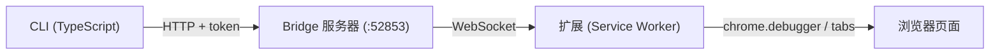
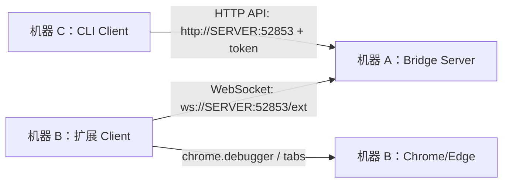

# Browser Bridge CLI

[English](./README.md) | [中文](./README_CN.md)

通过浏览器扩展，使用命令行控制已打开的 Chrome/Edge 浏览器。



## 安装

```bash
# 全局安装
npm i -g browser-bridge-cli

# 或直接使用（无需安装）
npx browser-bridge-cli info

# 或使用 Bun
bunx browser-bridge-cli info
```

### 安装为 AI Agent Skill

```bash
# 安装到 Claude Code
npx skills add dreamhunter2333/browser-bridge-cli/skill --agent claude-code

# 安装到多个 agent
npx skills add dreamhunter2333/browser-bridge-cli/skill --agent claude-code codex

# 全局安装
npx skills add dreamhunter2333/browser-bridge-cli/skill --agent claude-code -g
```

## 前置要求

- Node.js >= 20 或 [Bun](https://bun.sh/) >= 1.0
- Chrome 或 Edge 浏览器

## 平台支持

- Windows、macOS、Linux 均支持常规 CLI 使用，包括 `server start`、`server stop`、`server status`、配对、标签页控制、截图、PDF 导出、网络日志、Cookie 和原始 CDP 命令。
- `server install-service` 仅支持 Linux，因为它安装的是 systemd user service。Windows 和 macOS 请使用 `server start` 启动 bridge。
- CI 会在 `ubuntu-latest` 和 `windows-latest` 上运行构建与 e2e 测试。

## 配置

### 1. 加载浏览器扩展

从 [GitHub Releases](https://github.com/dreamhunter2333/browser-bridge-cli/releases) 下载扩展 zip 包，或使用源码中的 `extension/` 目录。

1. 打开 Chrome/Edge → `chrome://extensions`
2. 开启 **开发者模式**
3. 点击 **加载已解压的扩展** → 选择解压后的扩展目录

### 2. 启动服务器 + 配对

```bash
# 1. 启动服务器
npx browser-bridge-cli server start

# 2. 打开扩展弹窗 → 开启开关 →（可选：设置服务器 URL）

# 3. 生成配对码
npx browser-bridge-cli server gen-pair

# 4. 在扩展弹窗中输入 6 位配对码 → 点击 Pair
```

## 三台机器部署

Browser Bridge 可以把三个角色分别放在三台机器上：



适用场景：浏览器开在一台机器上，长期运行的 Bridge Server 放在另一台机器上，命令从第三台机器发出。

### 机器 A：Bridge Server

把服务器启动在另外两台机器能访问到的地址上：

```bash
npx browser-bridge-cli server start --host 0.0.0.0 --port 52853 --token <server-token>
```

注意：

- 防火墙或安全组需要放行 TCP `52853`。
- 尽量使用 VPN、SSH tunnel、带 HTTPS 的反向代理或内网访问，不建议把未保护的端口直接暴露到公网。
- 妥善保管 `<server-token>`。它可以生成配对码，也可以撤销 client token。
- Linux 上可以安装为 user service：

```bash
npx browser-bridge-cli server install-service --host 0.0.0.0 --port 52853 --token <server-token>
```

每个 client 都需要单独生成一个配对码。配对码一次性使用，5 分钟过期：

```bash
npx browser-bridge-cli --server http://<server-ip>:52853 --token <server-token> server gen-pair
```

### 机器 B：浏览器 + 扩展 Client

在运行 Chrome/Edge 的机器上安装并加载扩展。

在扩展弹窗里：

1. 打开扩展开关。
2. 把服务器 URL 设置为 `ws://<server-ip>:52853/ext`。
3. 输入机器 A 生成的配对码。
4. 点击 **Pair**。

配对后，这台机器会保持到机器 A 的 WebSocket 连接。浏览器所在机器不需要运行 CLI。

### 机器 C：CLI Client

在发命令的机器上安装或直接运行 CLI：

```bash
npx browser-bridge-cli pair --server http://<server-ip>:52853 -n <cli-name>
```

输入机器 A 新生成的配对码。CLI 会把 client token 保存到 `~/.browser-bridge/config.json`。

之后如果配置已保存，命令可以省略 `--server`：

```bash
npx browser-bridge-cli info
npx browser-bridge-cli tabs
npx browser-bridge-cli new-tab https://example.com
```

也可以只在单条命令里显式指定服务器：

```bash
npx browser-bridge-cli --server http://<server-ip>:52853 tabs
```

### Token 模型

- Server token：机器 A 的管理凭证，可以生成配对码和撤销 token。
- 扩展 client token：扩展配对后保存，用于认证 WebSocket 连接。
- CLI client token：机器 C 执行 `pair --server` 后保存，可以执行浏览器命令，但不能生成配对码。

如果不想交互式配对 CLI，也可以直接写入配置或环境变量：

```bash
npx browser-bridge-cli config set server http://<server-ip>:52853
npx browser-bridge-cli config set token <client-or-server-token>

# 或者
export BROWSER_BRIDGE_URL=http://<server-ip>:52853
export BROWSER_BRIDGE_TOKEN=<client-or-server-token>
```

## 命令列表

下方所有 `npx browser-bridge-cli ...` 命令都可以等价替换为 `bunx browser-bridge-cli ...`。

```bash
# 服务器管理
npx browser-bridge-cli server start [--host 0.0.0.0] [--port 9000] [--token xxx]
npx browser-bridge-cli server stop
npx browser-bridge-cli server status
npx browser-bridge-cli server gen-pair
npx browser-bridge-cli server install-service [--uninstall]   # systemd 守护进程 (Linux)

# 配对
npx browser-bridge-cli pair [-n name]               # 本地：生成配对码给扩展
npx browser-bridge-cli pair --server http://remote   # 远程：输入配对码连接 CLI
npx browser-bridge-cli unpair                        # 撤销凭证

# 配置
npx browser-bridge-cli config get                    # 查看配置（token 已脱敏）
npx browser-bridge-cli config set <key> <value>      # 设置 server、token 或 name
npx browser-bridge-cli config reset                  # 清除所有配置

# 浏览器控制
npx browser-bridge-cli info                          # 服务器状态 + 客户端
npx browser-bridge-cli tabs                          # 列出所有标签页
npx browser-bridge-cli tab <id>                      # 标签页详情
npx browser-bridge-cli eval <expr> [-t id] [-k]      # 执行 JS
npx browser-bridge-cli eval-file <file> [-t id]      # 执行 JS 文件
npx browser-bridge-cli query <selector> [-t id]      # 查询 DOM
npx browser-bridge-cli new-tab [url]                 # 新建标签页
npx browser-bridge-cli close-tab <id>                # 关闭标签页
npx browser-bridge-cli activate <id>                 # 切换标签页
npx browser-bridge-cli navigate <url> [-t id]        # 导航
npx browser-bridge-cli reload [-t id] [--no-cache]   # 刷新
npx browser-bridge-cli screenshot [-o file] [-f]     # 截图
npx browser-bridge-cli pdf [-o file] [-t id]         # 导出 PDF
npx browser-bridge-cli network [-l limit] [--clear]  # 网络日志
npx browser-bridge-cli cookies [-u url] [-d domain]  # Cookie
npx browser-bridge-cli cdp <method> [params] [-t id] # 原始 CDP 命令
npx browser-bridge-cli detach [-t id]                # 分离调试器
npx browser-bridge-cli clients                       # 客户端列表
npx browser-bridge-cli switch <clientId>             # 切换活跃客户端
```

全局选项：`-s, --server <url>`、`--token <token>`

配置优先级：CLI 参数 > 环境变量 (`BROWSER_BRIDGE_URL`, `BROWSER_BRIDGE_TOKEN`) > `~/.browser-bridge/config.json` > `~/.browser-bridge/state.json`

## 开发

```bash
bun install
bun run dev -- info          # 开发模式运行 CLI
bun run dev:server           # 开发模式运行服务器
bun run build                # 构建 npm 包
bun run test                 # 运行 Playwright e2e 测试
```

## 安全

- Bridge 默认绑定 `127.0.0.1`
- 服务器 token 控制管理操作（生成配对码、撤销 token）
- 客户端 token 可执行浏览器命令，但不能生成配对码
- 配对接口有速率限制（HTTP: 5次/分钟/IP，WS: 5次失败/连接）
- 配对码一次性使用，5 分钟过期
- token 撤销会断开 WS 客户端
- 白名单限制按 URL 模式的标签页操作

## 许可证

MIT
