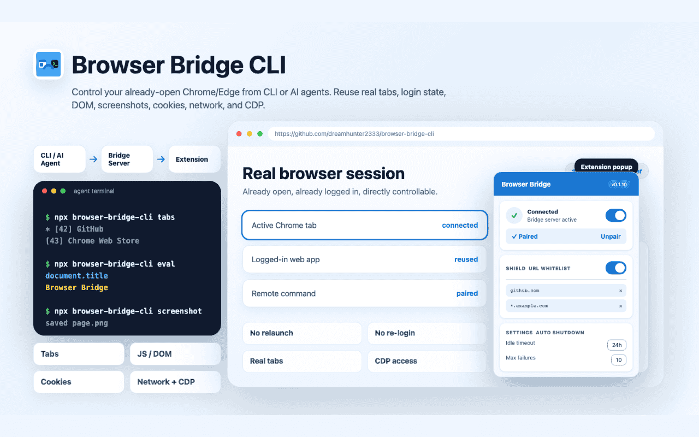
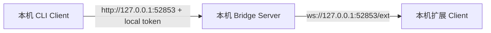
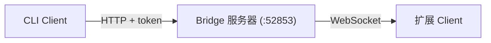
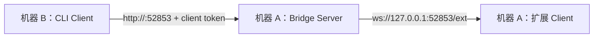
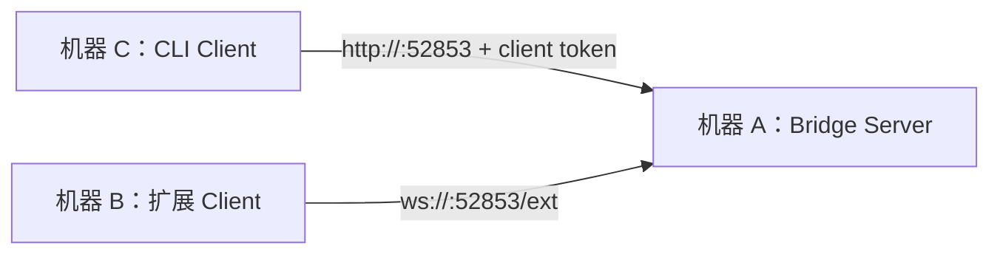

# Browser Bridge CLI

[English](./README.md) | [中文](./README_CN.md)

通过浏览器扩展，使用命令行控制已打开的 Chrome/Edge 浏览器。



## AI Agent Skills

### Browser Bridge CLI

```bash
# 安装到 Claude Code
npx skills add dreamhunter2333/browser-bridge-cli/skills/browser-bridge-cli --agent claude-code

# 安装到多个 agent
npx skills add dreamhunter2333/browser-bridge-cli/skills/browser-bridge-cli --agent claude-code codex

# 全局安装
npx skills add dreamhunter2333/browser-bridge-cli/skills/browser-bridge-cli --agent claude-code -g
```

### Browser Bridge CLI Skill Generator

用于创建通过 Browser Bridge CLI 操作一个或多个网站的流程型 skill。

```bash
# 安装到 Claude Code
npx skills add dreamhunter2333/browser-bridge-cli/skills/browser-bridge-cli-skill-generator --agent claude-code

# 安装到多个 agent
npx skills add dreamhunter2333/browser-bridge-cli/skills/browser-bridge-cli-skill-generator --agent claude-code codex

# 全局安装
npx skills add dreamhunter2333/browser-bridge-cli/skills/browser-bridge-cli-skill-generator --agent claude-code -g
```

## 快速开始

这是默认部署：CLI、Bridge Server、浏览器和扩展都在同一台机器上运行。

<details>
<summary>本机拓扑</summary>


```mermaid
graph LR
    CLI["本机 CLI Client"]
    Bridge["本机 Bridge Server"]
    Ext["本机扩展 Client"]

    CLI -->|"http://127.0.0.1:52853 + local token"| Bridge
    Bridge -->|"ws://127.0.0.1:52853/ext"| Ext
```

</details>

### 1. 安装

```bash
# 全局安装
npm i -g browser-bridge-cli

# 或直接使用
npx browser-bridge-cli info

# 或使用 Bun
bunx browser-bridge-cli info
```

### 2. 安装浏览器扩展

从 [Chrome Web Store](https://chromewebstore.google.com/detail/browser-bridge/cmakbjpcmibhleibmgaiflpoencnelol) 安装 Browser Bridge。

<details>
<summary>手动安装</summary>

如需手动安装，从 [GitHub Releases](https://github.com/dreamhunter2333/browser-bridge-cli/releases) 下载扩展文件：

- `.zip`：解压后通过 **加载已解压的扩展** 加载目录。
- 源码：加载源码中的 `extension/` 目录。

1. 打开 Chrome/Edge -> `chrome://extensions`
2. 开启 **开发者模式**
3. 点击 **加载已解压的扩展** -> 选择扩展目录

</details>

### 3. 启动 Server 并配对扩展

```bash
npx browser-bridge-cli server start
npx browser-bridge-cli server gen-pair
```

打开扩展弹窗，打开开关，保持 `ws://127.0.0.1:52853/ext`，输入 6 位配对码，然后点击 **Pair**。

### 4. 验证

```bash
npx browser-bridge-cli info
npx browser-bridge-cli tabs
```

本机 CLI 命令不需要 `--server`。CLI 会从 `~/.browser-bridge/` 读取本机 server state，Server 默认绑定 `127.0.0.1`。

<details>
<summary>架构</summary>


```mermaid
graph LR
    CLI["CLI Client"]
    Bridge["Bridge 服务器 (:52853)"]
    Ext["扩展 Client"]

    CLI -->|"HTTP + token"| Bridge
    Bridge -->|"WebSocket"| Ext
```

</details>

## 与 Playwright CLI 和 OpenCLI 对比

Playwright CLI 是成熟的浏览器自动化和测试工具。它的 [attach flow](https://playwright.dev/agent-cli/commands/attach) 和 [MCP extension mode](https://playwright.dev/mcp/configuration/browser-extension) 现在也可以通过 CDP、Playwright server endpoint 或 Playwright Extension 连接已有 Chrome/Edge，因此也能复用登录态和已打开的浏览器标签页。

OpenCLI 可以把网站、浏览器会话、Electron 应用和本地工具变成面向人和 AI Agent 的 CLI 接口。它更适合确定性站点命令、可复用 adapter 和更广的命令中心场景。

Browser Bridge CLI 不是要替代 Playwright 测试或 OpenCLI adapter。它定位更小：给已经打开的日常浏览器加一层可配对、可远程、可脚本化的控制桥，适合从另一个终端、另一个 agent 或另一台机器发命令。

| 维度 | Browser Bridge CLI | Playwright CLI | OpenCLI |
| --- | --- | --- | --- |
| 产品定位 | 面向用户真实 Chrome/Edge 的远程控制桥 | 基于 Playwright 的自动化、测试和 agent 工作流 | 面向网站、浏览器会话、Electron 应用和本地工具的 CLI hub |
| 浏览器连接 | 已配对扩展 -> Bridge Server -> CLI | 启动浏览器、CDP attach、Playwright endpoint 或 Playwright Extension | 浏览器扩展 + 本地 daemon，并支持 profile/session 选择 |
| 复用已有登录态 | 默认场景 | CDP attach 或 extension mode 支持 | 通过 Chrome session 复用支持 |
| 标签页模型 | 可列出、切换并按 tab id 控制已打开标签页，受白名单规则限制 | 通常围绕 Playwright session/page 工作；extension mode 连接被选择/授权的标签页，不是全局标签页控制桥 | 通过 browser session、target 和 adapter 工作，不以全局标签页 broker 为核心 |
| 远程拓扑 | 内置支持单机、两台机器、三台机器部署 | 通常偏本机；远程依赖 CDP endpoint、Playwright server、tunnel 或 MCP 配置 | 主要是本机浏览器/daemon 工作流 |
| 命令面 | 直接 CLI 原语：tabs、eval、query、screenshot、PDF、cookies、network、raw CDP | 更完整的自动化模型：locator、assertion、snapshot、trace、storage state、test runner | 站点 adapter、浏览器原语、Electron 应用 adapter 和已注册的本地 CLI 工具 |
| 认证模型 | 配对码 + server/client token；远程 CLI 可配对和撤销 | 取决于 Playwright session、CDP endpoint、MCP client 或扩展授权流程 | 通过扩展/daemon 设置复用 Chrome 登录态 |

需要可重复的浏览器自动化、测试、locator、断言、trace 或 Playwright agent 工具时，优先用 Playwright CLI。需要针对特定站点、桌面应用或本地工具的确定性命令和 adapter 时，用 OpenCLI。需要把命令打进一个已经打开的真实浏览器，并且希望多标签控制和远程机器部署是一等能力时，用 Browser Bridge CLI。

## 高级部署

当 CLI 不在扩展和/或 Bridge Server 所在机器上时，使用下面的高级部署方式。

### 两台机器

<details>
<summary><strong>两台机器：Server + Extension 同机，CLI 远程</strong></summary>

适用于浏览器和扩展在一台机器上运行，命令从另一台机器发出的场景。


```mermaid
graph LR
    CLI["机器 B：CLI Client"]
    Bridge["机器 A：Bridge Server"]
    Ext["机器 A：扩展 Client"]

    CLI -->|"http://<browser-machine-ip>:52853 + client token"| Bridge
    Bridge -->|"ws://127.0.0.1:52853/ext"| Ext
```

在机器 A 上，把 Server 启动在机器 B 可以访问到的地址上：

```bash
npx browser-bridge-cli server start --host 0.0.0.0 --port 52853 --token <server-token>
npx browser-bridge-cli server gen-pair
```

在机器 A 的扩展弹窗里：

1. 打开扩展开关。
2. 服务器 URL 保持为 `ws://127.0.0.1:52853/ext`。
3. 输入 6 位配对码并点击 **Pair**。

在机器 A 上为远程 CLI 生成新的配对码：

```bash
npx browser-bridge-cli server gen-pair
```

在机器 B 上配对机器 A：

```bash
npx browser-bridge-cli pair --server http://<browser-machine-ip>:52853 -n <cli-name>
```

然后从机器 B 执行命令：

```bash
npx browser-bridge-cli info
npx browser-bridge-cli tabs
npx browser-bridge-cli new-tab https://example.com
```

注意：

- 机器 A 需要允许机器 B 访问 TCP `52853`。
- 配对码只能使用一次，5 分钟过期。
- 不要在机器 B 上执行 `server ...` 命令。

</details>

### 三台机器

<details>
<summary><strong>三台机器：Server、Extension、CLI 分离</strong></summary>

适用于 Bridge Server、浏览器扩展、CLI 分别运行在不同机器上的场景。


```mermaid
graph LR
    CLI["机器 C：CLI Client"]
    Bridge["机器 A：Bridge Server"]
    Ext["机器 B：扩展 Client"]

    CLI -->|"http://<server-ip>:52853 + client token"| Bridge
    Ext -->|"ws://<server-ip>:52853/ext"| Bridge
```

在机器 A 上启动 Server：

```bash
npx browser-bridge-cli server start --host 0.0.0.0 --port 52853 --token <server-token>
npx browser-bridge-cli server gen-pair
```

在机器 B 上加载扩展并配对：

1. 打开扩展开关。
2. 把服务器 URL 设置为 `ws://<server-ip>:52853/ext`。
3. 输入机器 A 生成的 6 位配对码。
4. 点击 **Pair**。

在机器 A 上为 CLI 生成新的配对码：

```bash
npx browser-bridge-cli server gen-pair
```

在机器 C 上配对机器 A：

```bash
npx browser-bridge-cli pair --server http://<server-ip>:52853 -n <cli-name>
```

然后从机器 C 执行命令：

```bash
npx browser-bridge-cli info
npx browser-bridge-cli tabs
npx browser-bridge-cli new-tab https://example.com
```

注意：

- 机器 A 需要允许机器 B 和机器 C 访问 TCP `52853`。
- 尽量使用内网、VPN、SSH tunnel 或 HTTPS 反向代理。
- `<server-token>` 只保留在机器 A。

</details>

## 原生 CDP 文件上传与拖放

保持原有 `cdp <method> [params]` 接口，新增 `--session <id>`，可直接向 iframe 子会话发送命令（Chrome 125+）。
新增 `cdp-events -t <tab-id>` 启动并读取有界事件缓存，返回原始 `method/params/sessionId`；使用 `--stream <id> --since <cursor>` 继续读取，`--method` 和 `--session` 可过滤结果。

文件路径上传使用 `DOM.setFileInputFiles`，动态选择器使用 `Page.fileChooserOpened`，文件拖放使用 `Input.dispatchDragEvent`。连续调用必须指定同一标签页并使用 `-k`；文件路径属于浏览器所在机器。事件读取是轮询，不是阻塞等待或 WebSocket 订阅。

## 标签页远控

观看端完成 WebSocket 握手后才开始采集和 attach。最后一个观看端断开时立即停止采集并释放共享 lease；内存中的空闲共享通道在最后一次确认观看端存活后的 5 分钟内销毁，固定链接继续保留，再次打开会重建通道。有客户端连接但没有键鼠操作时不会触发此超时。

共享复用 Bridge 的端口（默认 `52853`），通过 `/share/<固定hash>/` 访问，不再监听另一个端口，也不在链接里放 token。

```bash
browser-bridge-cli share start                 # 启动共享，返回三种链接
browser-bridge-cli share links --tab 123       # 获取三种链接，可选指定固定 Tab
browser-bridge-cli share status 'http://127.0.0.1:52853/share/HASH/'
browser-bridge-cli share stop 'http://127.0.0.1:52853/share/HASH/'
```

- `share links` 返回 `links.tab`（固定 Tab）、`links.active`（跟随当前 Tab）、`links.browser`（可切换 Tab）。省略 `--tab` 时取当前 Tab，`--client` 选择浏览器。兼容的观看端连接后才开始采集，CLI 退出不影响共享。分享定义保存在 `~/.browser-bridge/shares.json`；重启 Bridge 后再次访问原链接即可恢复。链接 hash 来自已配对客户端名称和 tab ID／`active`／`browser`。指定 tab 的 ID 在浏览器重启后可能变化。
- 默认仅监听 localhost，观看无需登录；监听 `0.0.0.0` 等非回环地址时，创建分享必须加 `--username viewer`，并通过 `BROWSER_BRIDGE_SHARE_PASSWORD` 环境变量提供密码（可用 `--password-env` 改变量名）。浏览器使用标准用户名密码登录框，地址里不含凭证。公网使用 HTTPS。
- `links.browser` 默认左侧栏，支持搜索、收起、调宽和切到顶部，过滤内部页、白名单拦截页及观看页。不同分享路径共用端口，但同一源 tab 同时只能被一个分享采集。
- 三个分享模式统一使用 WebCodecs VP8 串流，无需模式开关或系统库。采集上限 1920 × 1080，目标 2 Mbps、最多约 15 fps，实际码率和帧率随内容和设备变化。
- 支持点击、拖动、滚动、直接输入及中文输入法。需重新加载包含 `offscreen` 权限的最新版扩展；观看页使用 localhost 或 HTTPS，不支持编解码时明确报错。VP8 为有损编码；源窗口远宽于观看面板时，文字仍会缩小。
- 共享不会被普通 CLI 命令或 detach 打断。普通调试连接无操作满 **5 分钟自动 detach**，后续操作刷新计时，直播持续保活。

详细说明见 [CLI 标签页共享](docs/tab-sharing.md)。

## 命令规则

- `server ...` 命令只在 Bridge Server 所在机器执行。
- 不要给 `server ...` 命令传 `--server`。
- 远程 CLI 机器执行 `pair` 时必须带 `--server http://<server-host>:52853`。
- 远程 CLI 配对后，普通浏览器控制命令可以通过保存的配置省略 `--server`。
- 单条远程命令可以传 `--server http://<server-host>:52853 --token <client-token>`。

## Token 模型

- Server token：Bridge Server 机器上的管理凭证，可以生成配对码和撤销 client token。
- 扩展 client token：扩展配对后保存，用于认证扩展 WebSocket。
- CLI client token：远程 CLI 机器执行 `pair --server` 后保存，可以执行浏览器命令，但不能生成配对码或管理 server。

配对码只能使用一次，5 分钟过期。每个 client 都需要单独生成一个配对码。

## 命令列表

下方所有 `npx browser-bridge-cli ...` 命令都可以等价替换为 `bunx browser-bridge-cli ...`。

```bash
# 服务器管理
npx browser-bridge-cli server start [--host 0.0.0.0] [--port 9000] [--token xxx]
npx browser-bridge-cli server stop
npx browser-bridge-cli server status
npx browser-bridge-cli server gen-pair
npx browser-bridge-cli server install-service [--uninstall]   # systemd 守护进程 (Linux)

# 配对
npx browser-bridge-cli pair [-n name]                  # 本机快捷方式：生成扩展配对码
npx browser-bridge-cli pair --server http://remote     # 远程 CLI：输入 Server 生成的配对码
npx browser-bridge-cli unpair                          # 撤销凭证

# 配置
npx browser-bridge-cli config get                    # 查看配置（token 已脱敏）
npx browser-bridge-cli config set <key> <value>      # 设置 server、token 或 name
npx browser-bridge-cli config reset                  # 清除所有配置

# 浏览器控制
npx browser-bridge-cli info                          # 服务器状态 + 客户端
npx browser-bridge-cli tabs                          # 列出所有标签页
npx browser-bridge-cli tab <id>                      # 标签页详情
npx browser-bridge-cli eval <expr> [-t id] [-k]      # 执行 JS
npx browser-bridge-cli eval-file <file> [-t id]      # 执行 JS 文件
npx browser-bridge-cli query <selector> [-t id]      # 查询 DOM
npx browser-bridge-cli new-tab [url]                 # 新建标签页
npx browser-bridge-cli close-tab <id>                # 关闭标签页
npx browser-bridge-cli activate <id>                 # 切换标签页
npx browser-bridge-cli navigate <url> [-t id]        # 导航
npx browser-bridge-cli reload [-t id] [--no-cache]   # 刷新
npx browser-bridge-cli screenshot [-o file] [-f] [--long --max-height px --hide-sticky] [--x px --y px --width px --height px] # 截图
npx browser-bridge-cli pdf [-o file] [-t id]         # 导出 PDF
npx browser-bridge-cli network [-l limit] [-t id] [--clear] # 指定标签页的 CDP 网络日志
npx browser-bridge-cli cookies [-u url] [-d domain] [-t id]  # 指定标签页 URL 上下文的 CDP Cookie
npx browser-bridge-cli cdp <method> [params] [-t id] # 原始 CDP 命令
npx browser-bridge-cli detach [-t id]                # 分离调试器
npx browser-bridge-cli clients                       # 客户端列表
npx browser-bridge-cli switch <clientId>             # 切换活跃客户端
```

长截图会使用当前视口宽度，并根据页面高度自适应截图高度。默认最大高度是 `30000`；遇到超高页面或无限滚动页面时，用 `--max-height` 控制上限。为避免重复页头，第一张之后会隐藏 fixed 元素；sticky 元素默认保留，需要时可用 `--hide-sticky` 隐藏。

网络和 Cookie 命令都走目标标签页的 CDP。`network` 会启用并读取每个标签页自己的 CDP Network 缓存，不再使用扩展级 `webRequest` 权限。

```bash
npx browser-bridge-cli screenshot --long -o page.png
npx browser-bridge-cli screenshot --long --max-height 12000 -o page.png
npx browser-bridge-cli screenshot --long --hide-sticky -o page.png
```

全局选项：`-s, --server <url>`、`--token <token>`

配置优先级：CLI 参数 > 环境变量 (`BROWSER_BRIDGE_URL`, `BROWSER_BRIDGE_TOKEN`) > `~/.browser-bridge/config.json` > `~/.browser-bridge/state.json`

## 平台支持

- Windows、macOS、Linux 均支持常规 CLI 使用。
- `server install-service` 仅支持 Linux，因为它安装的是 systemd user service。
- CI 会在 `ubuntu-latest` 和 `windows-latest` 上运行构建与 e2e 测试。

## 开发

```bash
bun install
bun run dev -- info          # 开发模式运行 CLI
bun run dev:server           # 开发模式运行服务器
bun run build                # 构建 npm 包
bun run test                 # 运行 Playwright e2e 测试
```

## 安全

- Bridge 默认绑定 `127.0.0.1`。
- Server token 控制管理操作。
- Client token 可执行浏览器命令，但不能生成配对码。
- 配对接口有速率限制：HTTP 5次/分钟/IP，WS 每连接 5 次失败。
- 配对码只能使用一次，5 分钟过期。
- token 撤销会断开 WebSocket client。
- 白名单限制按 URL 模式的标签页操作。

隐私政策：[PRIVACY.md](./PRIVACY.md)

## 许可证

MIT
